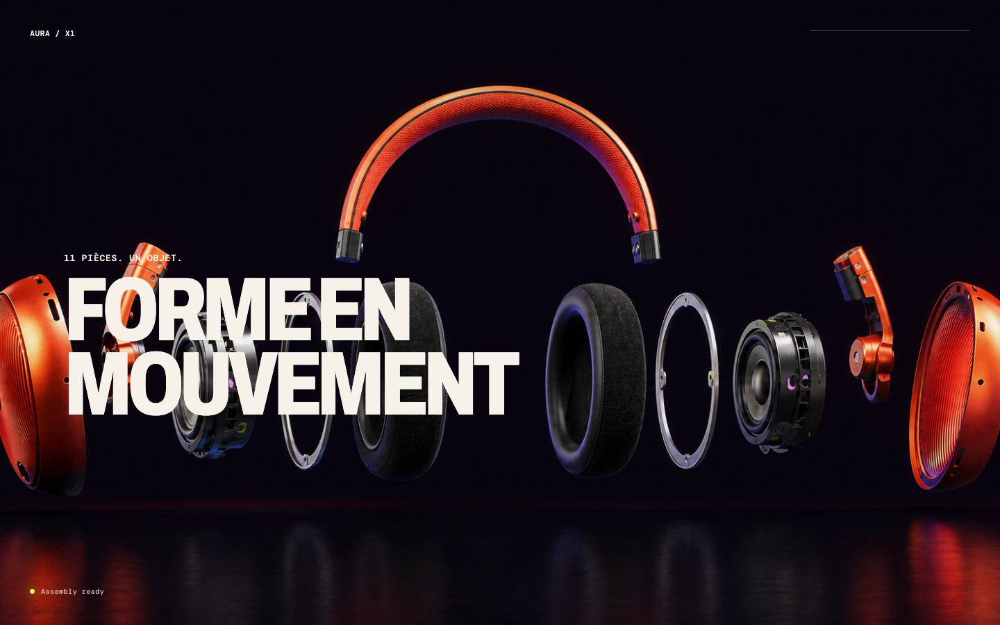
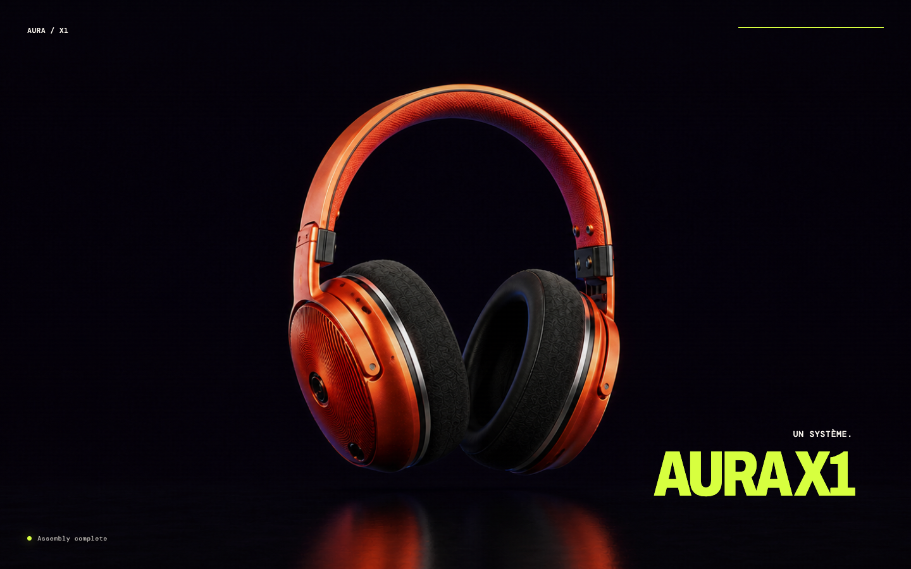

# ScrollScrub — AURA X1

## En bref

**Ce que c’est :** une démo de présentation produit dans laquelle les pièces d’un casque s’assemblent pendant le défilement.

**À quoi elle sert :** montrer comment synchroniser une animation de produit avec la progression de la page.

**Ce qui a été réalisé :** onze couches PNG, positions de départ et d’arrivée, états casque éclaté et assemblé, défilement et respect du mode réduit.

**Technologies :** Vite, JavaScript, Canvas 2D, GSAP et ScrollTrigger.

AURA X1 est un concept visuel pour la démo, pas une boutique ni un produit commercial livré.



## Technique explorée

L’interface dessine onze couches PNG transparentes dans un Canvas 2D. GSAP ScrollTrigger lie le défilement à une progression de zéro à un ; les coordonnées de départ et d’arrivée de chaque pièce sont définies dans `src/data/components.json`. Deux images complètes encadrent l’animation : vue éclatée et casque assemblé.

Cette version utilise des images et des masques 2D, sans modèle 3D. Elle ne lit pas de vidéo pendant l’animation. Un ancien essai d’extraction de frames vidéo reste documenté dans les scripts et plans, mais n’est pas le moteur de la page actuelle.



## Lancer la démo

Prérequis : Node.js 20.19+ ou 22.12+ et npm, selon les contraintes de Vite 7. La préparation du portfolio a été vérifiée avec Node.js 26.7.0 sur macOS Apple Silicon.

```sh
npm ci
npm run dev -- --host 127.0.0.1
```

Ouvrir l’adresse affichée par Vite, puis faire défiler la page. Pour vérifier la version compilée :

```sh
npm run build
npm run preview -- --host 127.0.0.1
```

Les sources peuvent être téléchargées avec **Code → Download ZIP** sur GitHub. Il faut ensuite extraire l’archive et exécuter les commandes ci-dessus. Il n’y a ni backend, ni compte utilisateur, ni application native à installer. Aucun site public hébergé n’est associé à ce dépôt pour l’instant.

## Organisation

| Emplacement | Rôle |
|---|---|
| `src/main.js` | Chargement des images, interpolation, rendu Canvas et ScrollTrigger |
| `src/style.css`, `index.html` | Mise en page et textes de la démo |
| `src/data/components.json` | Coordonnées source/cible des onze pièces |
| `assets/source/` | Références conservées pour retravailler les images |
| `assets/components/` | Couches découpées |
| `public/assets/` | Copies servies au navigateur |
| `scripts/` | Découpe des pièces et ancien essai d’extraction vidéo |
| `docs/superpowers/plans/` | Plans des deux approches explorées |
| `docs/screenshots/` | Captures réelles de la démo |

## Retravailler les assets

Avec ImageMagick installé, régénérer les couches à partir de `assets/source/exploded.png` :

```sh
bash scripts/segment-components.sh
```

Le script utilise des masques et coordonnées calibrés pour une image de 1672 × 941 px. Il copie maintenant les résultats vers `public/assets/components/`, pour que la page utilise bien les couches recalculées. En changeant de référence, adapter les masques ainsi que le manifeste de coordonnées. Si les deux images complètes changent, reporter aussi `exploded.png` et `assembled.png` dans `public/assets/source/`.

`scripts/extract-frames.sh` est l’essai antérieur vidéo. Il nécessite `ffmpeg` et `cwebp` et écrit une séquence dans `public/sequence/` ; il remplace les anciennes frames de ce dossier. La page actuelle n’utilise pas cette séquence et ces exports régénérables sont exclus de Git. Les scripts sont lancés explicitement, jamais pendant l’installation des dépendances.

## État et limites

Statut : prototype frontend fonctionnel pour présenter une animation. Le parcours initial → assemblage et le mode mouvement réduit ont été vérifiés dans Chromium ; les détails sont dans [VERIFICATION.md](VERIFICATION.md).

- L’effet de profondeur est simulé par des images 2D, sans rotation libre ni simulation physique.
- Les PNG sont chargés avant le démarrage ; il reste à mesurer le chargement et la consommation mémoire sur de vrais téléphones.
- Le lien « Découvrir AURA X1 » mène à la section de présentation de la même page. Il n’existe pas de fiche produit, panier ou achat derrière ce lien.
- Le mode mouvement réduit affiche directement le casque assemblé. Les autres navigateurs, les lecteurs d’écran et la navigation complète au clavier restent à auditer.
- Le cadrage desktop est volontairement large et peut couper les pièces aux extrémités ; les captures représentent le rendu réel, sans recomposition.

Pour reprendre : mesurer les performances sur mobile, optimiser les images utilisées, compléter les tests du rendu responsive, puis choisir un hébergement statique pour `dist/`. Les plans inclus expliquent l’évolution de l’essai vidéo vers l’approche par composants.

## Dépôt et téléchargement

[Voir le dépôt](https://github.com/cpointis96-hue/scrollscrub) · [Télécharger les sources ZIP](https://github.com/cpointis96-hue/scrollscrub/archive/HEAD.zip). Le ZIP contient les sources ; lancer la démo avec les commandes ci-dessus.
